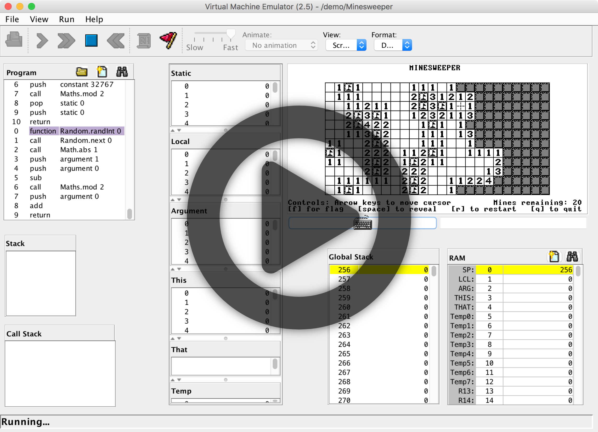
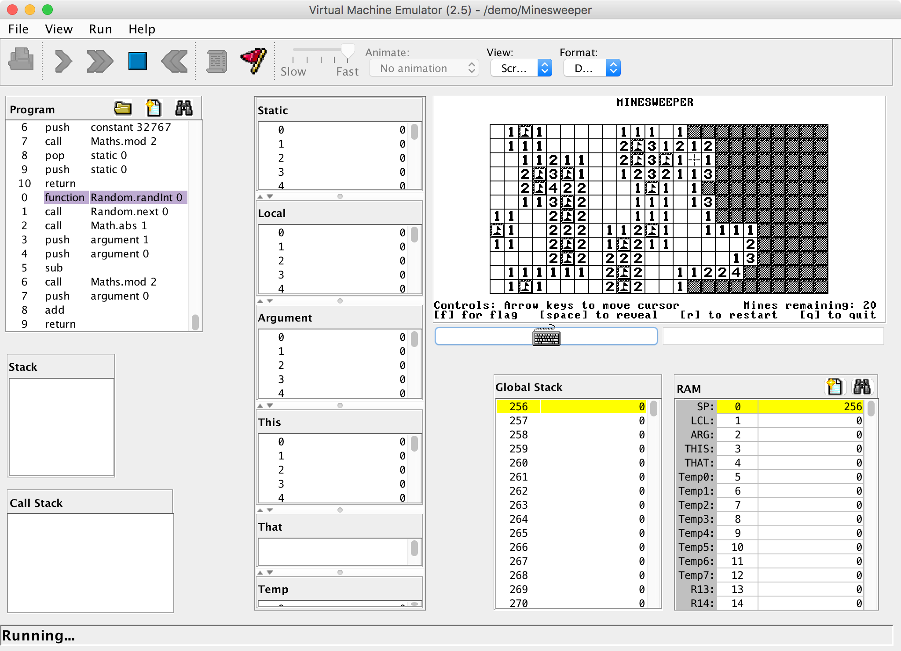
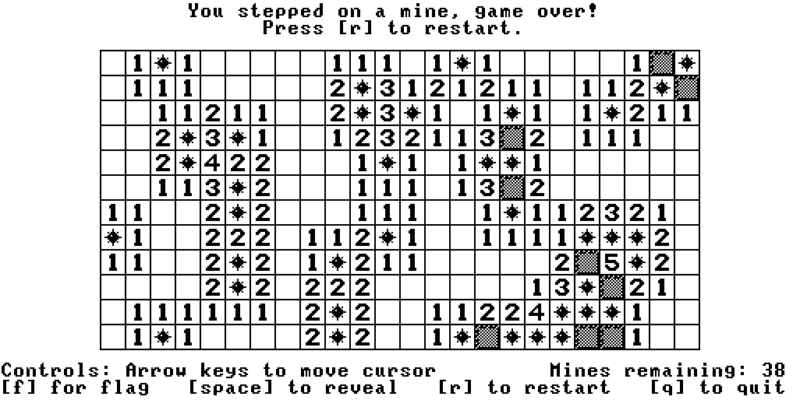
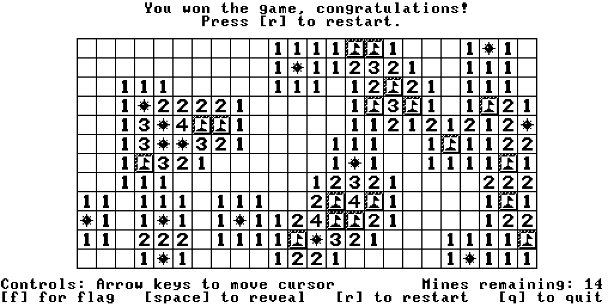
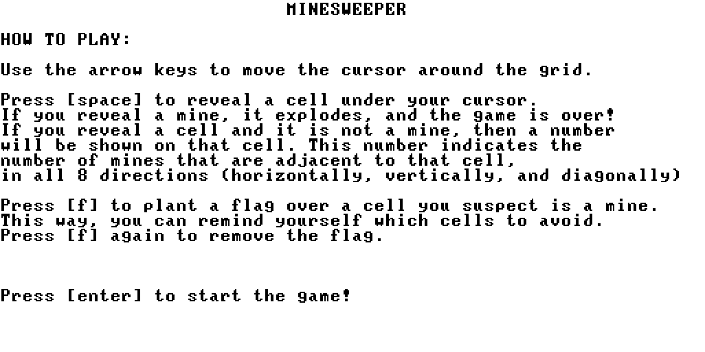
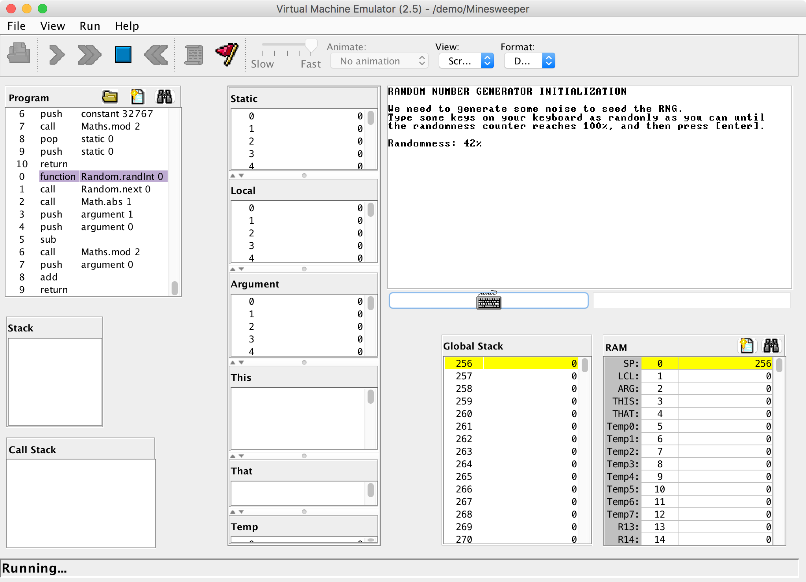

# nand2minesweeper

## 🎞 Watch the Demo 🎞

## What is this?

This is my final project (Project 9) for the [nand2tetris](https://www.nand2tetris.org/) course! It's a Minesweeper game written in the Jack language.

nand2tetris is one of the most rewarding computer science courses I've taken. The course challenges us to build a full application (in this case, Minesweeper) using a high level language (the Jack language) compiled using a compiler we wrote ourselves, with an operating system we write ourselves, running on a hardware platform (the Hack machine) we designed ourselves, powered by a CPU we wired together ourselves. There is nothing left to "magic" and everything is built by the students down to the transistors!

## Who are you?

Nice to meet you, I'm [Bill Mei](https://billmei.net). I help companies build React and Ruby on Rails apps. [Get in touch if you want to hire me](https://billmei.net/contact). I'm also writing a book to help you learn how to write [maintainable, easy-to-understand CSS](https://www.painlesscss.com).

## How to load the game

Download the [nand2tetris software suite](https://www.nand2tetris.org/software) and run the script `tools/VMEmulator.sh` (on Unix machines) or `tools/VMEmulator.bat` (on Windows machines).

In the VMEmulator Java Applet, click on the folder icon to open a project, and then navigate to the `nand2minesweeper` directory.

Click on the `nand2minesweeper` folder and then click "Load Program" to load it.

Click "Yes" when it says "No implementation was found for some functions which are called in the VM code".

Set the "Animate" dropdown option to "No animation".

Finally, click on the fast forward button to run the game!

I pre-compiled the `.vm` files for you in the in the `nand2minesweeper` directory so you can run the game without compiling. If you would like to compile the `.vm` files yourself, then use your [nand2tetris software suite](https://www.nand2tetris.org/software) to run the JackCompiler to compile all the `.jack` files in the `nand2minesweeper` folder into `.vm` files.

## How to play Minesweeper

Use the arrow keys <kbd>←</kbd><kbd>↑</kbd><kbd>↓</kbd><kbd>→</kbd> to move the cursor around the grid.

Press <kbd>space</kbd> to reveal a cell under your cursor. If you reveal a mine, it explodes, and the game is over! If you reveal a cell and it is not a mine, then a number will be shown on that cell. This number indicates the number of mines that are adjacent to that cell, in all 8 directions (horizontally, vertically, and diagonally).

Press <kbd>f</kbd> to plant a flag over a cell you suspect is a mine. This way, you can remind yourself which cells to avoid. Press <kbd>f</kbd> again to remove the flag.

Press <kbd>r</kbd> to restart the game at any time.

Press <kbd>q</kbd> to quit the game and halt execution.

## Screenshots

### Game in Progress

---

### Game Lost

---

### Game Won

---

### Tutorial

---

---

## License

MIT License
