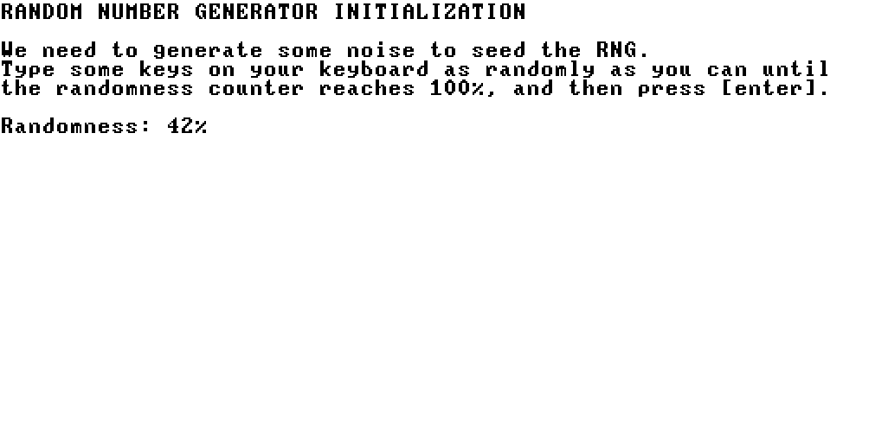

# Minesweeper

## Screenshots

### Game in Progress

### Game Lost

### Game Won

### Tutorial

### Random Number Generator

## How to load the game

The compiled .vm files should already be available to you in the `Minesweeper` directory. If you did not receive the .vm files, then using your nand2tetris software suite, run the JackCompiler to compile all the .jack files in the `Minesweeper` folder into .vm files.

Using your nand2tetris software suite, run the VMEmulator.

Click on the folder icon to open a project, and then navigate to the `Minesweeper` directory.

Click on this folder and then click "Load Program" to load it.

Click "Yes" when it says "No implementation was found for some functions which are called in the VM code".

Set the "Animate" dropdown option to "No animation".

Finally, click on the fast forward button to run the game!

## How to play

Use the arrow keys to move the cursor around the grid.

Press [space] to reveal a cell under your cursor. If you reveal a mine, it explodes, and the game is over! If you reveal a cell and it is not a mine, then a number will be shown on that cell. This number indicates the number of mines that are adjacent to that cell, in all 8 directions (horizontally, vertically, and diagonally).

Press [f] to plant a flag over a cell you suspect is a mine. This way, you can remind yourself which cells to avoid. Press [f] again to remove the flag.

Press [r] to restart the game at any time.

Press [q] to quit the game and halt execution.
